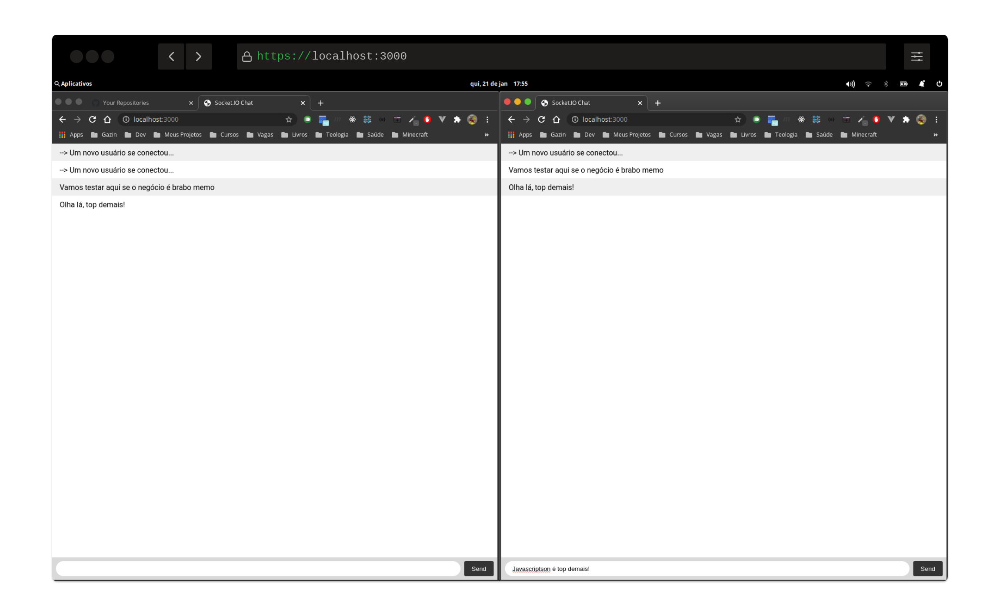

# Node Real Time Chat with Socket.IO
> Frameworks: Express and Socket.IO

### Real Time
> Alerts when the user enters or leaves the session


## How to run
```shell
# after starts, access on http://localhost:3000
npm install && npm start
```